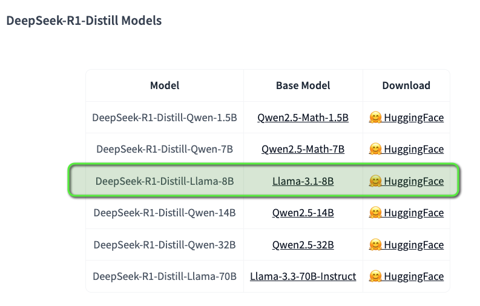
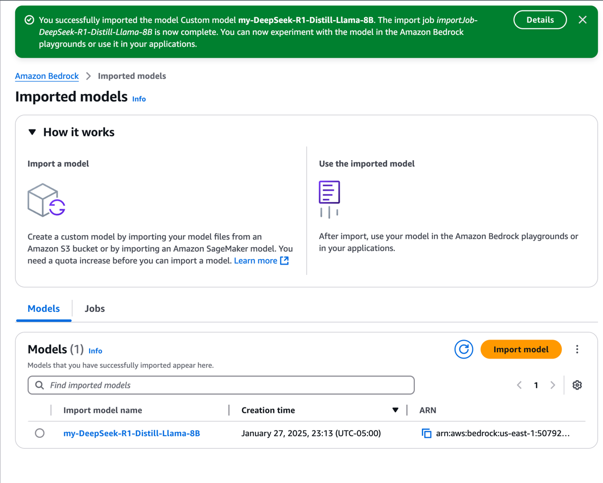

# DeepSeek-R1 on Amazon Bedrock

This repository will guide you through the process of importing and using the distilled **DeepSeek-R1-Distill-Llama-8B** model based on **Llama-3.1-8B** as the base model from [Hugging Face](https://huggingface.co/deepseek-ai/DeepSeek-R1) on [Amazon Bedrock](https://docs.aws.amazon.com/bedrock/latest/userguide/what-is-bedrock.html). 

To learn more about DeepSeek-R1, please visit [DeepSeek](https://www.deepseek.com).
For detailed paper walkthrough on DeepSeek-R1: Incentivizing Reasoning Capability in LLMs via Reinforcement Learning, check out this paper read on DeepSeek-R1 by [Umar Jamil](https://www.youtube.com/watch?v=XMnxKGVnEUc&t=2421s)

## Prerequisites

- AWS Account with Bedrock access
- Python environment with the following packages:
  - `huggingface_hub`
  - `boto3`

## Setup Process

1. **Download Model Weights**
   - The model weights are downloaded from Hugging Face Hub
   - Model used: `deepseek-ai/DeepSeek-R1-Distill-Llama-8B`

2. **Upload to S3**
   - Model weights are uploaded to an S3 bucket
   - Target path: `s3://[your-bucket]/models/DeepSeek-R1-Distill-Llama-8B/`

3. **Import to Amazon Bedrock**
   - Navigate to AWS Console > Bedrock > Foundation Models > Imported Models
   - Click "Import Model"
   - Name the model (e.g., `my-DeepSeek-R1-Distill-Llama-8B`)
   - Provide the S3 location of the model weights
   - Wait for successful import
   - Note down the Model ARN for API calls

## Usage

Run the Jupyter notebook `deepseek-bedrock.ipynb` for detailed implementation.

